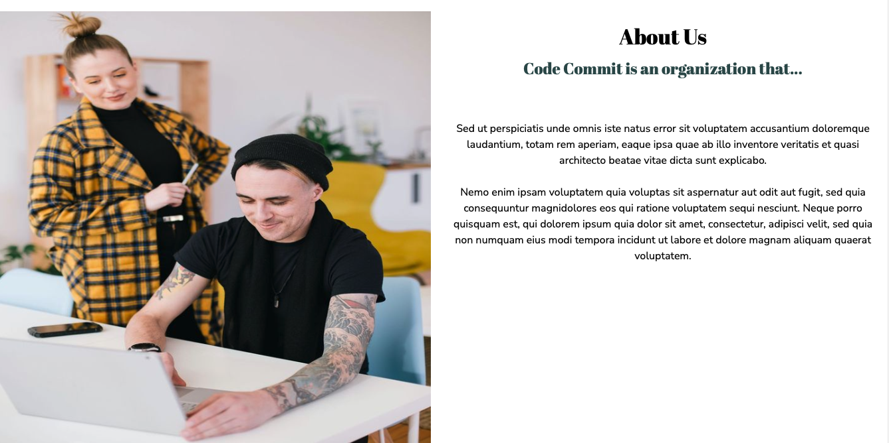
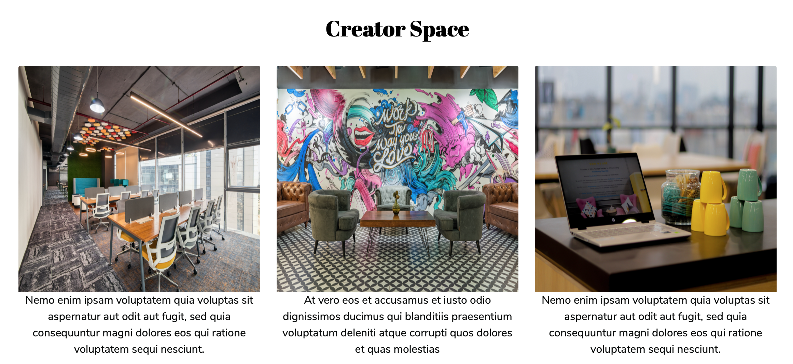

# Code Commit

## Website 
Start up website for a coding group/meetup

A simple landing page which includes navigation between the different information sections. 
Navigation bar provides option to link to external pages
The join us form allows visitors to register their interest in joining the group
* Form to be linked to Postgresql DB to store user input

### Website 
For reference, see the ["Screenshots" section](#screenshots) below.

The website consists of 4 navigation links:
*Home (disabled)
*About us
*Creator Space
*Join us

* A [landing page](#image1) 

* About us section [about us](#image3)

* A Creator Space section including images of office space [Creator Space](#image4) 

### Screenshots

This section contains screenshots of example pages to be built, at varying screen widths. These are a guide.

#### 

Landing page:

#### 

About us:

#### 

Creator Space:

### Credits

All images, available for public use, were sourced from unsplash.com. This project does not claim any ownership or credit over the images. The images are available here:

Image 1: (head.jpg):
Annie Spratt
https://unsplash.com/photos/hCb3lIB8L8E

Image 2: (inspire.jpg)
Leon: @myleon
https://unsplash.com/photos/fznQW-kn5VU

Creator Space images:
myHQ Workspaces
https://unsplash.com/@myhq

### Website Design
The website was inspired by Mashup
